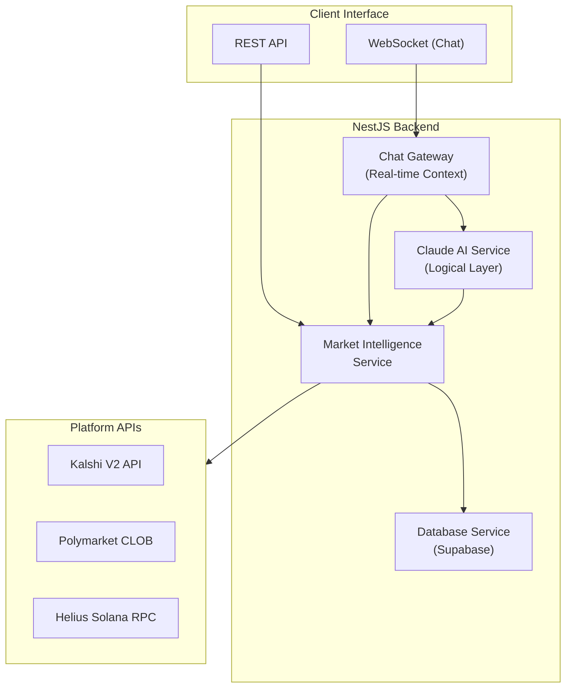

# PredictMax 

PredictMax is an elite AI agent specialized in prediction market analysis and optimization. Built as a sophisticated financial intelligence layer, it helps traders discover, analyze, and execute opportunities across Kalshi, Polymarket, and the broader Solana ecosystem.

---

##  Architecture Overview

PredictMax is built on a modular NestJS architecture designed for real-time data ingestion and AI-powered analysis.



---

##  Agent Workflow & Decision Tree

PredictMax follows a strict intelligence gathering and analysis loop to ensure data-driven responses.

### 1. Intent Identification
When a user interacts, the agent categorizes the request:
- **Market Discovery**: "Find me crypto markets..."
- **Risk Analysis**: "Analyze the spread on this NBA market..."
- **Comparative Intelligence**: "Polymarket vs Kalshi for Fed rates?"

### 2. Contextual Data Ingestion
The agent proactively fetches real-time data based on the identified category.
- **Sports/Politics/Crypto**: Specific platform queries.
- **Trending**: High-volume market aggregation.

### 3. AI Analytical Layer
Claude 3.5 Sonnet processes the raw market data (Order books, Volume, End dates) through specialized prompts:
- **Implied Probability Calculation**
- **Liquidity Risk Assessment**
- **Opportunity Scoring (1-100)**

---

##  Key Features

- **Real-time Chat**: WebSocket-based interactive agent with "typing" state and session persistence.
- **Unified Discovery**: Cross-platform search for Kalshi and Polymarket in one request.
- **Market Analysis**: Deep-dive analysis into spreads, volume efficiency, and outcome factors.
- **Solana Integration**: Powered by Helius for real-time Solana blockchain data.
- **Deterministic Cleanup**: Professional, emoji-free financial reporting.

---

##  Tech Stack

- **Framework**: [NestJS](https://nestjs.com/) (Node.js)
- **AI Model**: Claude 3.5 Sonnet (Anthropic SDK)
- **Database**: [Supabase](https://supabase.com/) (PostgreSQL)
- **Real-time**: Socket.io
- **Integrations**: Axios for Platform APIs, Helius SDK for Solana.

---

##  Getting Started

### 1. Prerequisites
- Node.js (v18+)
- Supabase Project
- API Keys (Anthropic, Kalshi, Polymarket, Helius)

### 2. Installation
```bash
git clone https://github.com/notanaveragelifter/predictmax.git
cd predictmax
npm install
```

### 3. Configuration
Copy the `.env.example` to `.env` and fill in your keys:
```env
ANTHROPIC_API_KEY=sk-ant-xxx
SUPABASE_URL=https://xxx.supabase.co
SUPABASE_ANON_KEY=eyJ...
KALSHI_API_KEY=xxx
POLYMARKET_API_KEY=xxx
HELIUS_API_KEY=xxx
```

### 4. Database Setup
Execute the SQL found in [`supabase-schema.sql`](./supabase-schema.sql) in your Supabase SQL editor.

### 5. Run the Agent
```bash
# Development mode
npm run start:dev

# Production build
npm run build
npm run start:prod
```

---

##  API Reference

### REST Endpoints
- `GET /api/markets` - List unified markets.
- `GET /api/markets/trending` - High-volume opportunities.
- `GET /api/markets/discover` - AI-powered discovery analysis.
- `GET /api/markets/analyze/:platform/:id` - Detailed technical score.

### WebSocket (ws://localhost:3000/chat)
- `message`: Send user prompts.
- `message_response`: Receive AI intelligence.
- `assistant_typing`: UI state indicator.

---

##  Risk Disclaimer
Prediction markets involve substantial risk. PredictMax provides data-driven analysis for informational purposes only. Past market behavior does not guarantee future results.
